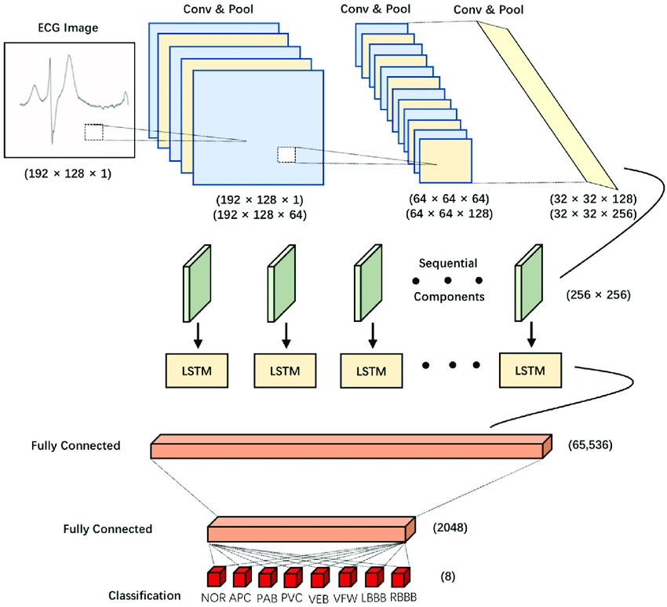

# Dry Lab Task1

## 任务定义

对DNA序列进行启动子/非启动子序列判断，实际可抽象为二元分类问题。

我们可以定义一个二分类概率模型：

$P(y = 1 | \mathbf{x}; \theta) = \sigma(f(\mathbf{x}; \theta))$

其中：

- $f(\mathbf{x}; \theta)$ 是模型的预测函数。
- $\sigma(z) = \frac{1}{1 + e^{-z}} $是Sigmoid 函数，用于映射到概率空间。

为了训练模型，可以采用交叉熵损失函数：

$\mathcal{L}(\theta) = -\frac{1}{N} \sum_{i=1}^{N} \left[y_i \log P(y_i | \mathbf{x}_i; \theta) + (1 - y_i) \log(1 - P(y_i | \mathbf{x}_i; \theta))\right]$

其中：

- 第一项对应$y_i = 1 $时的损失（希望概率接近 1）。
- 第二项对应$y_i = 0 $时的损失（希望概率接近 0）。

## 数据及模型

### 数据集来源及处理

使用数据集为[HuggingFace](https://huggingface.co/datasets/dnagpt/dna_core_promoter)提供的`dna_core_promoter`。

由于机器学习模型训练依赖数值输入，需要在数据预处理过程中进行碱基序列的形式转换，例如使用one-hot编码将碱基转化为四维向量，或通过k-mer分解将碱基序列转化为碱基组合的出现频率。此处使用one-hot编码方式进行预处理。

### 模型选择

对于可考虑的模型进行结合实际任务的分析：MLP容易忽略DNA序列中碱基之间的顺序信息，可能无法有效处理序列数据；CNN注重局部特征，适合处理具有局部关联性的序列数据，但可能忽视全局上下文信息；RNN在设计上考虑了序列数据的处理，能够捕捉序列中的时间依赖性，但限制对长序列依赖的建模能力；LSTM作为RNN的改进，可通过引入门控机制有效缓解梯度消失问题，捕捉长距离依赖关系。另外，Transformer基于自注意力机制，能够并行处理序列数据，捕捉全局上下文信息，但需要的算力消耗较大。

综上所述，考虑到序列数据的特性和模型性能，LSTM和Transformer表现最好；但考虑到算力和调优时间，以及该任务对准确率并无绝对要求，我选择构建CNN与LSTM混合模型，前者重点进行特征提取、后者进行序列建模，以尽可能捕获序列信息。

### 模型原理及结构

CNN模块捕捉DNA序列中局部保守模式，卷积层滑动扫描、池化层降低维度；LSTM层则将CNN输出的每个位置的特征视为时间步，通过门控机制捕捉特征序列中的长期依赖；最终全连接层将LSTM输出的高维表示映射到低维空间，激活二分类函数。模型结构可类比下图。



## 结果及分析

### 模型测试准确率

```
Test Accuracy:0.8226
```

多次测试准确率均在0.83左右。

源代码仓库地址：[[remoe-id/igem2025](https://github.com/remoe-id/igem2025/tree/master)](https://github.com/remoe-id/igem2025)

### 部分发现

我另外使用相同数据集训练了RNN/LSTM混合模型，得到的准确率为0.60左右，极大低于CNN/LSTM模型。原因可能是RNN/LSTM混合模型中对于输入数据的局部特征有较多的忽略，特征提取方面表现较差。